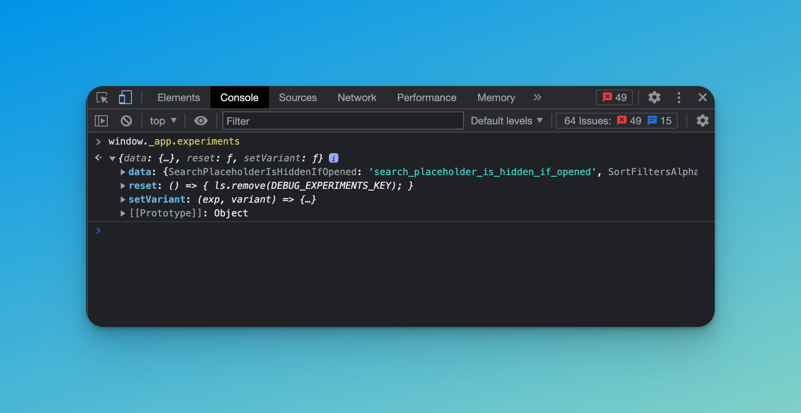
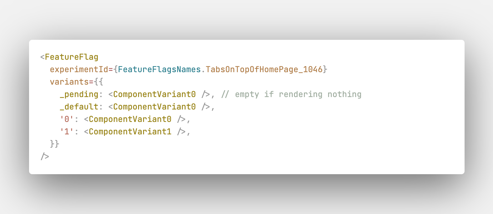

# Experiments

Implemented here: `apps/website/src/entities/optimize/model.ts`
Also, try to find with this search query: `@see DEBUG`

If you wanna test and assign experiment variant, try to use **LocalStorage** values:

Key:

```
DEBUG_EXPERIMENTS
```

### Internal API

Open inspector and type in console:

```
window._app.experiments
```



1. Field `data` is all implemented experiments ID in the codebase! Name of experiments and ID.
2. Function `reset()` to clear all attached mock variants in LocalStorage. The same like clear LocalStorage. Just invoke from console.

```
window._app.experiments.reset()
```

3. Function `setVariant()` to attach specific experiment with mock value. First argument is experiment ID, second argument is value.

Example:

```
window._app.experiments.setVariant('xYN-QhNoRWut8QqFKrpSdg', '1')
```

To check, open LocalStorage and find `DEBUG_EXPERIMENTS` key.

### Details about implementation

There are 4 states of each experiments in codebase (if it's about A/B testing, not multi-variants):

- `pending`
- `default`
- `variant_A`
- `variant_B`

`Pending` means that we still don't receive correct variant from Google Optimize. `Default` value means that experiment is not enabled in Google Optimize. And next options are variants: '1' or '0' for example.

In codebase we have a ways to implement that:

**#1 Use the react component:**



