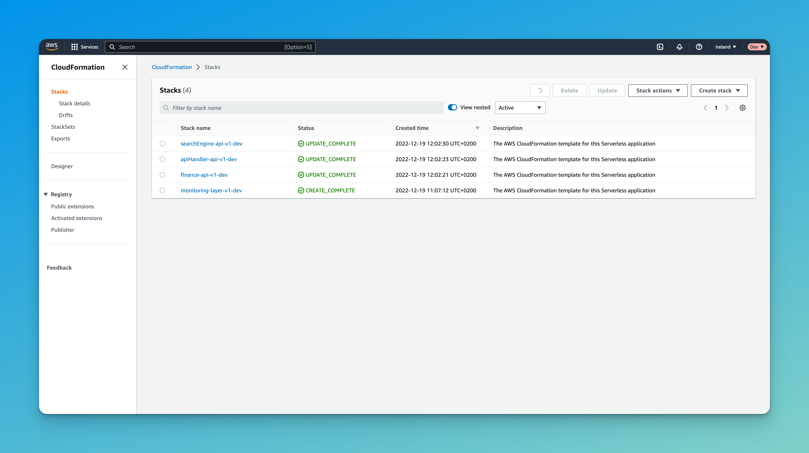

# Serverless

## Example of lambda (template)

```
/* eslint-disable */
// prettier-ignore-start
require('../../.pnp.cjs').setup();
import 'source-map-support/register';

import path from 'path';

import { APIGatewayEvent, Context } from 'aws-lambda';
import { Logger } from '@aws-lambda-powertools/logger';
import { Tracer } from '@aws-lambda-powertools/tracer';
// prettier-ignore-end
/* eslint-enable */

const filename = path.basename(__filename);

const logger = new Logger({ serviceName: filename });
const tracer = new Tracer({ serviceName: filename });

export const awsLambdaHandler = async (event: APIGatewayEvent, context: Context) => {
    tracer.getSegment();
    logger.addContext(context);

    try {
        logger.info('Request start');

        // Codebase

        return undefined;
    } catch (error) {
        logger.error('Lambda error', error as Error);
        return undefined;
    } finally {
        logger.info('Request end');
    }
};
```

### Environment variables

There are tree layers of all envs:

1. serverless.com
2. ...
3.

### How deploy with hard reset?

That is correct serverless stacks!



1. Go to AWS Cloudformation.
2. Delete all stacks (without selected checkboxes).
   Sometimes, can be too long. But, also sometimes, helpful will be removing log groups from CloudWatch.
3. Redeploy from CI workflow.

### Health extension (API Layer)

Lambda layer. The main reference is:

- https://github.com/aws-samples/aws-lambda-extensions/tree/main/nodejs-example-logs-api-extension/nodejs-example-logs-api-extension

### Snippets

**Example of invocation lambda function from AWS sdk**

```js
import { Lambda } from '@aws-sdk/client-lambda'

const lambdaClient = new Lambda({ region: process.env.AWS_DEFAULT_REGION })

const env = process.env.VITE_DOMAIN_ENV

const invokeFunctions = async (name) => {
  const result = await lambdaClient.invoke({
    FunctionName: name,
    InvocationType: 'RequestResponse',
  })

  const responseObject = JSON.parse(new TextDecoder('utf-8').decode(result.Payload) || '{}')
  console.log(
    `Function ${name}: ${JSON.stringify({ statusCode: responseObject.statusCode, body: responseObject.body })}`,
  )
}

await invokeFunctions(`apiHandler-api-v1-${env}-updateConfigFiles`)
```
